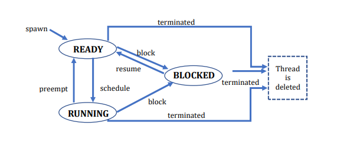

# User-Level Threads Library (uthreads)

## Overview

This project is a user-level threads (uthreads) library, developed as part of the Hebrew University OS course. It provides the ability to manage multiple threads at the user level, without relying on kernel-level threading. The library includes support for thread creation, termination, blocking, resuming, and sleeping. It also features a timer mechanism to manage thread execution, using quantums to control how long each thread runs.
### How the threads switch states 



## Features

- **Thread Creation and Management**: Supports creating up to 100 threads, each with its own stack and execution context.
- **Context Switching**: Uses `sigsetjmp` and `siglongjmp` to perform non-preemptive context switching between threads.
- **Thread States**: Manages threads in different states: `RUNNING`, `READY`, `BLOCKED`, and `SLEEPING`.
- **Sleeping Threads**: Threads can sleep for a specified number of quantums and automatically resume when their sleep time has elapsed.
- **Signal Handling**: Implements signal handling for timer-based preemption using `SIGVTALRM`.
- **Min-Heap for Thread IDs**: A priority queue manages available thread IDs efficiently.

## Files

- **uthreads.cpp**: The main implementation of the user-level threads library. It contains all the core functionality, including thread creation, termination, blocking, sleeping, and context switching.
- **uthreads.h**: The header file of the library. contains the 'public' functions of the library.
- **Makefile**: A build file used to compile the project.

## Key Functions

- `uthread_init(int quantum_usecs)`: Initializes the threading library with a specified quantum length.
- `uthread_spawn(thread_entry_point entry_point)`: Creates a new thread that starts execution at the provided entry point.
- `uthread_terminate(int tid)`: Terminates a thread based on its thread ID (`tid`).
- `uthread_block(int tid)`: Blocks a thread, preventing it from being scheduled for execution.
- `uthread_resume(int tid)`: Resumes a previously blocked thread.
- `uthread_sleep(int num_quantums)`: Puts the currently running thread to sleep for the specified number of quantums.
- `uthread_get_tid()`: Returns the thread ID of the currently running thread.
- `uthread_get_total_quantums()`: Returns the total number of quantums that have elapsed since the library was initialized.
- `uthread_get_quantums(int tid)`: Returns the number of quantums that a given thread has run.

## Thread States

- **RUNNING**: The thread is currently executing.
- **READY**: The thread is ready to execute but is not currently running.
- **BLOCKED**: The thread is blocked and cannot be scheduled until it is resumed.
- **SLEEPING**: The thread is sleeping and will be re-added to the ready queue once its sleep time is over.

## How to Compile

To compile the project, use the provided `Makefile`. Run the following command in your terminal:

```bash
make
